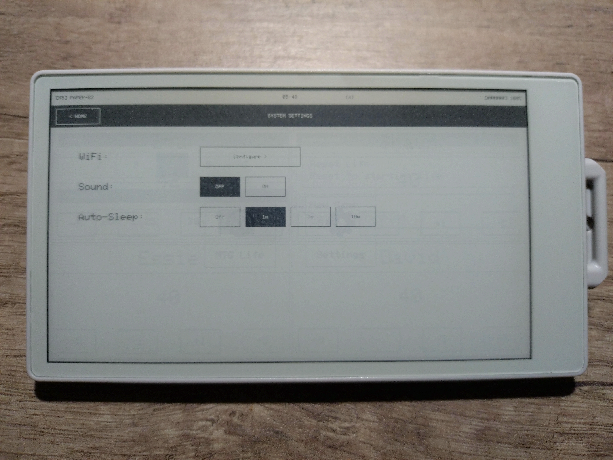

# M5Paper S3 App Platform

An app platform for the M5Paper S3 e-ink device featuring a home screen launcher and multiple apps.

## Screenshots

| Home Screen | MTG Life Counter |
|:-----------:|:----------------:|
|  |  |

| Game Settings | System Settings |
|:-------------:|:---------------:|
|  |  |

## Hardware

- **Device**: [M5Paper S3](https://docs.m5stack.com/en/core/M5Paper%20S3)
- **Display**: 4.7" e-ink, 960x540 pixels, 16 grayscale levels
- **MCU**: ESP32-S3 (dual-core 240MHz, 8MB PSRAM, 16MB Flash)
- **Touch**: GT911 capacitive, 2-point touch

## Features

- **Home Screen**: App launcher with icon grid
- **System Toolbar**: WiFi status, battery level, time display
- **Power Management**: Auto-sleep with configurable timeout, state persistence across sleep/wake
- **Settings App**: WiFi configuration, display settings, system info
- **MTG Life Counter**: Track life totals for 2-6 players with customizable names and starting life

## Building

Requires [PlatformIO](https://platformio.org/).

```bash
# Install dependencies and compile
pio run

# Upload to device
pio run -t upload

# Serial monitor
pio device monitor
```

## Project Structure

```
src/
├── app/           # App framework (App, Navigation, AppRegistry)
├── apps/          # Individual apps
│   ├── home/      # Home screen launcher
│   ├── mtg/       # MTG life counter
│   └── settings/  # System settings
├── assets/        # Icons and images
├── models/        # Data structures
├── platform/      # Device constants
├── ui/            # UI components and screens
└── utils/         # Utilities (power, sound, logging)
tools/
└── icons/         # Icon generation script
docs/
└── DEVELOPMENT.md # Developer guide
```

## Adding Icons

1. Place a 64x64 PNG or BMP in `src/assets/`
2. Build the project (icon conversion runs automatically)
3. Reference as `ICON_FILENAME` in code

## Development

See [docs/DEVELOPMENT.md](docs/DEVELOPMENT.md) for architecture overview and guide to creating new apps.

## License

MIT
